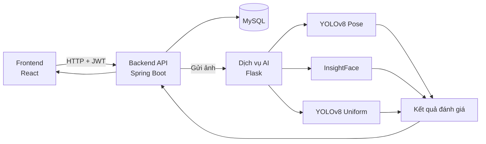

<h1 align="center">Hệ thống đánh giá tuân thủ đồng phục học sinh bằng AI</h1>

<p align="center">
  Nền tảng web hỗ trợ nhận diện học sinh, đánh giá đồng phục theo lịch lớp và quản lý kết quả từ ảnh.
</p>

<p align="center">
  
  
  
  
  
  
  
</p>

Hệ thống sử dụng **YOLOv8 Pose** để chọn học sinh chính trong ảnh, **InsightFace** để nhận diện hoặc xác minh học sinh và **YOLOv8 Uniform** để phát hiện các thành phần đồng phục.

Luồng đánh giá mặc định:

```text
Ảnh đầu vào
    ↓
YOLOv8 Pose
    ↓
InsightFace
    ↓
YOLOv8 Uniform
    ↓
Kiểm tra theo lịch đồng phục
    ↓
Kết quả và ảnh chú thích
```

Repository gồm ba phần chính:

- `frontend`: giao diện React.
- `backend`: REST API Spring Boot.
- `uniform-ai`: dịch vụ AI Flask.

> README này tập trung vào luồng đánh giá mặc định và các chức năng chính, giúp người đọc dễ theo dõi kiến trúc và cách chạy dự án.

## Mục lục

- [Chức năng chính](#chức-năng-chính)
- [Quy trình đánh giá](#quy-trình-đánh-giá)
- [Kiến trúc hệ thống](#kiến-trúc-hệ-thống)
- [Các lớp đồng phục](#các-lớp-đồng-phục)
- [Công nghệ sử dụng](#công-nghệ-sử-dụng)
- [Cấu trúc thư mục](#cấu-trúc-thư-mục)
- [Cài đặt và khởi động](#cài-đặt-và-khởi-động)
- [API chính](#api-chính)
- [Build và kiểm tra](#build-và-kiểm-tra)

## Chức năng chính

- Đăng ký, đăng nhập và phân quyền `ADMIN`/`STUDENT`.
- Quản lý học sinh, lớp học, tài khoản và dữ liệu khuôn mặt.
- Quản lý lịch đồng phục theo lớp và theo ngày.
- Tải ảnh học sinh để đánh giá đồng phục.
- Chọn học sinh chính trong ảnh bằng YOLOv8 Pose.
- Nhận diện hoặc xác minh học sinh bằng InsightFace.
- Phát hiện các thành phần đồng phục bằng YOLOv8 Uniform.
- Đối chiếu kết quả phát hiện với lịch đồng phục của lớp.
- Hiển thị điểm, trạng thái và ảnh đã chú thích.
- Lưu lịch sử đánh giá và kết quả chính thức.
- Thống kê kết quả và xử lý yêu cầu chỉnh sửa của học sinh.

## Quy trình đánh giá

### Bước 1: Tải ảnh

Quản trị viên chọn ảnh cần đánh giá trên giao diện web. Frontend gửi ảnh và thông tin liên quan đến backend.

### Bước 2: Chọn học sinh chính

YOLOv8 Pose phát hiện người trong ảnh và chọn người phù hợp nhất để tiếp tục xử lý.

### Bước 3: Nhận diện học sinh

InsightFace trích xuất đặc trưng khuôn mặt để nhận diện học sinh hoặc xác minh với mã học sinh được cung cấp.

### Bước 4: Phát hiện đồng phục

YOLOv8 Uniform phát hiện các thành phần đồng phục xuất hiện trên học sinh đã chọn.

### Bước 5: Kiểm tra theo lịch

Hệ thống so sánh các thành phần phát hiện được với lịch đồng phục của lớp trong ngày đánh giá.

### Bước 6: Trả kết quả

Hệ thống trả về:

- Học sinh được nhận diện.
- Các thành phần đồng phục được phát hiện.
- Thành phần đạt hoặc còn thiếu.
- Điểm đánh giá.
- Trạng thái đánh giá.
- Ảnh đã vẽ khung kết quả.

## Kiến trúc hệ thống



Frontend phụ trách giao diện và gửi yêu cầu. Backend xử lý nghiệp vụ, phân quyền và lưu dữ liệu. Dịch vụ AI nhận ảnh, thực hiện nhận diện và phát hiện đồng phục, sau đó trả kết quả về backend.

## Các lớp đồng phục

Mô hình YOLOv8 Uniform được huấn luyện để phát hiện sáu lớp:

| ID | Tên lớp | Ý nghĩa |
| ---: | --- | --- |
| 0 | `ao_so_mi_trang` | Áo sơ mi trắng |
| 1 | `ao_doan_thanh_nien` | Áo Đoàn Thanh niên |
| 2 | `quan_tay_dai_den` | Quần tây dài màu đen |
| 3 | `khan_quang_do` | Khăn quàng đỏ |
| 4 | `quan_short_tay_den` | Quần short màu đen |
| 5 | `quan_dai_trang` | Quần dài màu trắng |

## Công nghệ sử dụng

### Frontend

- React.
- TypeScript.
- Vite.
- React Router.
- Axios.
- CSS.

### Backend

- Java.
- Spring Boot.
- Spring Security.
- JWT.
- Spring Data JPA.
- MySQL.
- Maven.

### Dịch vụ AI

- Python.
- Flask.
- PyTorch.
- OpenCV.
- Ultralytics YOLOv8.
- InsightFace.
- ONNX Runtime.

## Cấu trúc thư mục

```text
uniform-lib/
├── backend/
│   ├── pom.xml
│   └── src/
│       ├── main/
│       └── test/
├── frontend/
│   ├── package.json
│   ├── vite.config.ts
│   ├── public/
│   └── src/
│       ├── api/
│       ├── components/
│       ├── context/
│       ├── pages/
│       ├── utils/
│       ├── App.tsx
│       ├── styles.css
│       └── types.ts
├── uniform-ai/
│   ├── app.py
│   ├── requirements.txt
│   ├── app/
│   │   ├── face/
│   │   ├── pose_estimation/
│   │   ├── services/
│   │   ├── uniform_validation/
│   │   └── utils/
│   ├── face-recognition-service/
│   ├── yolov8_6class/
│   ├── storage/
│   ├── uploads/
│   └── outputs/
└── README.md
```

Các thư mục như `node_modules`, `target`, `dist`, `.venv`, `uploads` và `outputs` là dependency, dữ liệu tạm hoặc dữ liệu phát sinh khi chạy ứng dụng.

## Cài đặt và khởi động

Các lệnh dưới đây giả sử terminal đang ở thư mục gốc `uniform-lib`.

### 1. Chuẩn bị cơ sở dữ liệu

Tạo database:

```sql
CREATE DATABASE IF NOT EXISTS uniform_management
  CHARACTER SET utf8mb4
  COLLATE utf8mb4_unicode_ci;
```

### 2. Khởi động dịch vụ AI

```powershell
cd uniform-ai
py -m venv .venv
.\.venv\Scripts\Activate.ps1
python -m pip install --upgrade pip
python -m pip install -r requirements.txt
Copy-Item .env.example .env
python app.py
```

Các tệp chính cần có:

- `uniform-ai/yolov8n-pose.pt`.
- `uniform-ai/yolov8_6class/best.pt`.
- Dữ liệu khuôn mặt đã đăng ký trong `uniform-ai/storage`.

Dịch vụ AI mặc định chạy tại:

```text
http://127.0.0.1:5001
```

### 3. Khởi động backend

Thiết lập các biến môi trường cần thiết:

```powershell
cd backend
$env:DB_URL="jdbc:mysql://localhost:3307/uniform_management?useSSL=false&allowPublicKeyRetrieval=true&serverTimezone=Asia/Ho_Chi_Minh&characterEncoding=UTF-8"
$env:SPRING_DATASOURCE_USERNAME="YOUR_DB_USERNAME"
$env:SPRING_DATASOURCE_PASSWORD="YOUR_DB_PASSWORD"
$env:SECURITY_JWT_SECRET="YOUR_SECRET_KEY_AT_LEAST_32_CHARACTERS"
$env:UNIFORM_ADMIN_EMAIL="YOUR_ADMIN_EMAIL"
$env:UNIFORM_ADMIN_PASSWORD="YOUR_ADMIN_PASSWORD"
$env:UNIFORM_AI_BASE_URL="http://127.0.0.1:5001"
$env:UNIFORM_AI_FACE_BASE_URL="http://127.0.0.1:5001"
$env:UNIFORM_AI_OUTPUT_ROOT=(Resolve-Path "..\uniform-ai\outputs").Path
mvn spring-boot:run
```

Backend mặc định chạy tại:

```text
http://localhost:8080
```

Không đưa mật khẩu, JWT secret hoặc thông tin đăng nhập thật lên GitHub.

### 4. Khởi động frontend

```powershell
cd frontend
npm install
```

Tạo file `frontend/.env.local`:

```dotenv
VITE_API_BASE_URL=http://localhost:8080
VITE_AI_MEDIA_BASE_URL=http://127.0.0.1:5001
```

Khởi động frontend:

```powershell
npm run dev
```

Frontend mặc định chạy tại:

```text
http://127.0.0.1:5173
```

## Cổng mặc định

| Thành phần | Cổng | Địa chỉ |
| --- | ---: | --- |
| Frontend | 5173 | `http://127.0.0.1:5173` |
| Backend | 8080 | `http://localhost:8080` |
| Dịch vụ AI | 5001 | `http://127.0.0.1:5001` |
| MySQL | 3307 | Cấu hình trong `DB_URL` |

## API chính

### Backend

| Phương thức | Endpoint | Mục đích |
| --- | --- | --- |
| POST | `/api/auth/register` | Đăng ký tài khoản |
| POST | `/api/auth/login` | Đăng nhập |
| POST | `/api/admin/evaluations/lightweight` | Đánh giá đồng phục từ ảnh |
| POST | `/api/evaluations/{runId}/choose-official` | Lưu kết quả chính thức |
| GET | `/api/evaluation-history` | Xem lịch sử đánh giá |
| GET | `/api/evaluation-history/me` | Xem lịch sử của học sinh |
| POST | `/api/correction-requests` | Gửi yêu cầu chỉnh sửa |
| GET/PUT | `/api/admin/uniform-requirement-schedules/{classId}` | Quản lý lịch đồng phục |
| GET | `/api/images/{id}` | Đọc ảnh kết quả |

### Dịch vụ AI

| Phương thức | Endpoint | Mục đích |
| --- | --- | --- |
| GET | `/api/ai/health` | Kiểm tra trạng thái dịch vụ |
| GET | `/api/uniform/health` | Kiểm tra module đánh giá |
| POST | `/api/ai/evaluate-student-lightweight` | Nhận diện học sinh và đánh giá đồng phục |
| POST | `/api/uniform/evaluate/lightweight` | Đánh giá đồng phục từ ảnh |
| POST | `/api/face/enroll` | Đăng ký dữ liệu khuôn mặt |
| POST | `/api/face/verify` | Xác minh học sinh |
| POST | `/api/face/identify` | Nhận diện học sinh |

Các API cần xác thực sử dụng JWT do backend cấp sau khi đăng nhập.

## Build và kiểm tra

### Frontend

```powershell
cd frontend
npm run build
```

### Backend

```powershell
cd backend
mvn test
mvn package -DskipTests
```

### Dịch vụ AI

```powershell
cd uniform-ai
.\.venv\Scripts\python.exe -m py_compile app.py
```

## Lưu ý khi đưa dự án lên GitHub

Không commit các nội dung sau:

- Mật khẩu, JWT secret hoặc file `.env` chứa dữ liệu thật.
- Thư mục môi trường ảo.
- Dependency đã cài đặt.
- Tệp build.
- Ảnh tải lên và ảnh kết quả.
- Dữ liệu khuôn mặt.
- Trọng số mô hình có dung lượng lớn nếu repository không sử dụng Git LFS.

Nên sử dụng `.gitignore` để loại bỏ các tệp runtime và thông tin nhạy cảm.
