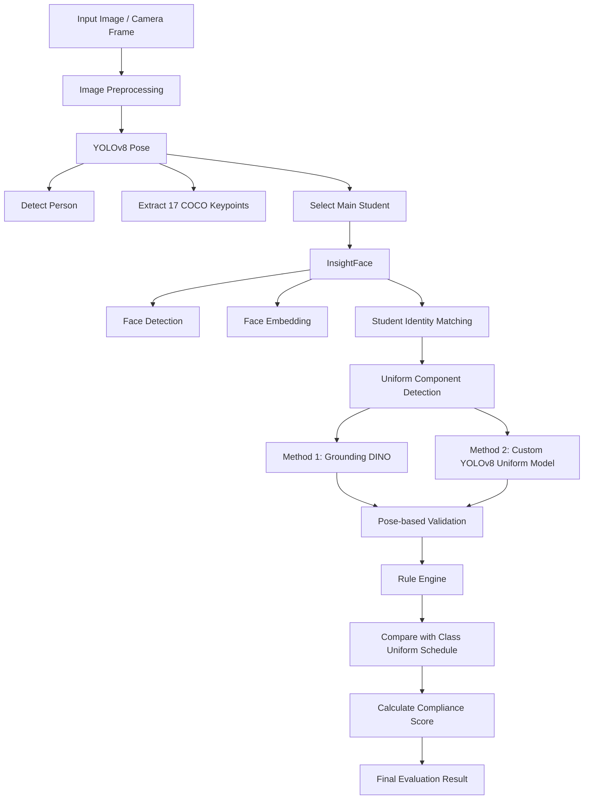
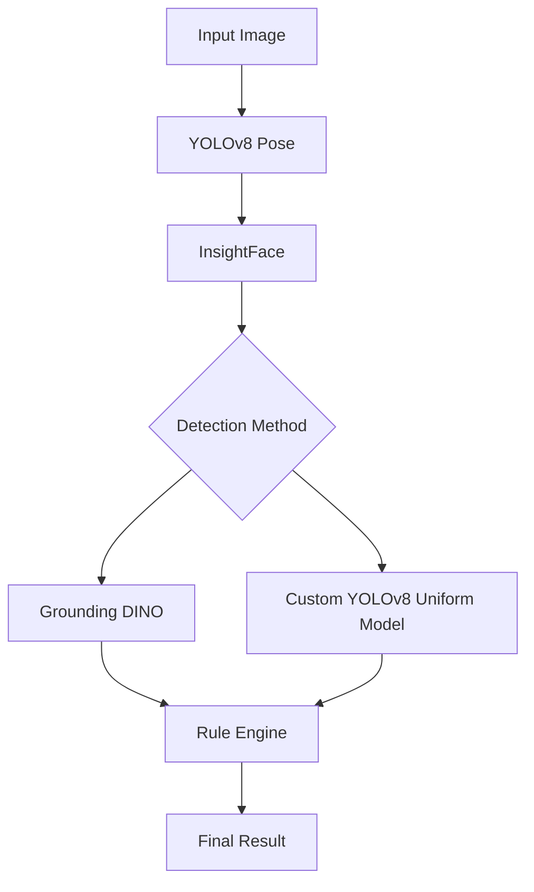

<div align="center">

# 🎓 AI-Based School Uniform Compliance Evaluation System

### Hệ thống đánh giá mức độ tuân thủ nội quy đồng phục học sinh bằng AI

<br/>


<br/>
<br/>

**Graduation Thesis Project**  
**University of Science and Technology — The University of Danang**

<br/>

</div>

---

## 📖 Table of Contents

- [Overview](#-overview)
- [Project Highlights](#-project-highlights)
- [Main Features](#-main-features)
- [AI Evaluation Pipeline](#-ai-evaluation-pipeline)
- [System Architecture](#️-system-architecture)
- [Tech Stack](#️-tech-stack)
- [Uniform Detection Classes](#-uniform-detection-classes)
- [AI Model Performance](#-ai-model-performance)
- [Scoring Rule](#-scoring-rule)
- [Project Structure](#-project-structure)
- [Getting Started](#-getting-started)
- [Main API Endpoints](#-main-api-endpoints)
- [GitHub Upload Notes](#-github-upload-notes)
- [Author](#-author)

---

## 📌 Overview

This project is an **AI-powered school uniform compliance evaluation system** developed for secondary school environments.

The system helps administrators and supervisors evaluate whether students comply with school uniform regulations by using uploaded images or real-time camera frames. It combines **Computer Vision**, **Face Recognition**, **Object Detection**, **Pose Estimation**, and a **Rule-based Evaluation Engine** to produce a clear and explainable compliance result.

> **Thesis topic:**  
> **Xây dựng hệ thống đánh giá mức độ tuân thủ nội quy đồng phục trong trường cấp 2**

The system was built as a complete graduation thesis project, including:

- A web-based management system.
- A Spring Boot backend API.
- A ReactJS frontend interface.
- A Flask-based AI service.
- A custom-trained YOLOv8 uniform detection model.
- Student identification using face recognition.
- Uniform compliance scoring based on class schedules.

---

## 🌟 Project Highlights

<table>
<tr>
<td width="50%">

### 🤖 AI + Web Integration

The project does not only train an AI model, but also integrates AI into a complete web system with authentication, management, history tracking, and real-time evaluation.

</td>
<td width="50%">

### 🎯 Custom YOLOv8 Model

A custom YOLOv8 model was trained to detect school uniform components such as white shirts, youth union shirts, black trousers, and red scarves.

</td>
</tr>
<tr>
<td width="50%">

### 🧍 Pose-based Validation

YOLOv8 Pose is used to select the main student and validate whether detected uniform components are located in reasonable body regions.

</td>
<td width="50%">

### 👤 Face Recognition

InsightFace is used to identify the student in the image, helping the system connect AI results with student records.

</td>
</tr>
<tr>
<td width="50%">

### 📷 Real-time Camera Support

The system supports lightweight real-time camera evaluation for faster practical use.

</td>
<td width="50%">

### 📝 Explainable Result

The final result is based on detected components, required class schedule, missing items, and a clear scoring rule.

</td>
</tr>
</table>

---

## ✨ Main Features

### 👨‍🏫 Admin / Supervisor

- Manage students, classes, accounts, and uniform schedules.
- Upload student images for AI-based uniform evaluation.
- Compare results from multiple AI evaluation methods.
- Save official evaluation results.
- View evaluation history and student violation records.
- Handle correction requests submitted by students.
- View statistics and compliance reports.
- Use real-time camera evaluation.

### 👨‍🎓 Student

- Log in to view personal information.
- View personal uniform evaluation history.
- View class uniform schedule.
- Submit correction requests when an evaluation result needs review.

### 🤖 AI Evaluation

- Detect the main student/person in the image.
- Extract human keypoints using YOLOv8 Pose.
- Identify student using InsightFace.
- Detect required uniform components.
- Validate detections using body regions and pose keypoints.
- Compare detected components with the class uniform schedule.
- Generate final decision:

| Result | Meaning |
|---|---|
| ✅ **Đạt** | Student complies with the required uniform rule |
| ⚠️ **Cần kiểm tra lại** | Result needs manual review |
| ❌ **Chưa đạt** | Student does not satisfy the required uniform rule |

---

## 🧠 AI Evaluation Pipeline



---

## 🏗️ System Architecture

```mermaid
flowchart LR
    subgraph FE[Frontend - ReactJS + TypeScript]
        FE1[Admin Dashboard]
        FE2[Student Portal]
        FE3[Upload Evaluation Page]
        FE4[Comparison Page]
        FE5[Real-time Camera Page]
        FE6[Statistics UI]
    end

    subgraph BE[Backend - Spring Boot]
        BE1[Authentication / JWT]
        BE2[Student Management]
        BE3[Class Management]
        BE4[Uniform Schedule]
        BE5[Evaluation History]
        BE6[Correction Requests]
        BE7[AI Service Client]
    end

    subgraph AI[AI Service - Flask]
        AI1[YOLOv8 Pose]
        AI2[InsightFace]
        AI3[Grounding DINO]
        AI4[Custom YOLOv8 Uniform Model]
        AI5[Pose Validation]
        AI6[Rule Engine]
    end

    subgraph DB[(MySQL Database)]
        DB1[Users]
        DB2[Students]
        DB3[Classes]
        DB4[Schedules]
        DB5[Evaluations]
        DB6[Correction Requests]
    end

    FE --> BE
    BE --> DB
    BE --> AI
```

---

## 🛠️ Tech Stack

### Frontend

| Technology | Purpose |
|---|---|
| ReactJS | Web user interface |
| TypeScript | Type-safe frontend development |
| Vite | Frontend build tool |
| MUI / Tailwind CSS | UI components and styling |
| Axios | API communication |

### Backend

| Technology | Purpose |
|---|---|
| Java | Main backend language |
| Spring Boot | REST API backend |
| Spring Security | Authentication and authorization |
| JWT | Token-based authentication |
| JPA / Hibernate | Database ORM |
| MySQL | Main database |
| Maven | Build and dependency management |

### AI Service

| Technology | Purpose |
|---|---|
| Python | AI service language |
| Flask | AI REST API |
| YOLOv8 | Pose estimation and uniform detection |
| InsightFace | Face recognition |
| Grounding DINO | Open-vocabulary object detection |
| OpenCV | Image processing |
| PyTorch | Deep learning framework |

---

## 🎯 Uniform Detection Classes

The custom YOLOv8 model was trained to detect key school uniform components.

| Class ID | Class Name | Meaning |
|---:|---|---|
| 0 | `ao_so_mi_trang` | White shirt |
| 1 | `ao_doan_thanh_nien` | Youth union shirt |
| 2 | `quan_tay_dai_den` | Black long trousers |
| 3 | `khan_quang_do` | Red scarf |

---

## 📊 AI Model Performance

Validation metrics of the custom YOLOv8 uniform detection model:

| Metric | Value |
|---|---:|
| Precision | **0.8784** |
| Recall | **0.8980** |
| mAP50 | **0.9204** |
| mAP50-95 | **0.5580** |

### Metric Meaning

| Metric | Description |
|---|---|
| Precision | Measures how many predicted uniform components are correct |
| Recall | Measures how many actual uniform components are successfully detected |
| mAP50 | Mean Average Precision at IoU threshold 0.50 |
| mAP50-95 | Mean Average Precision across IoU thresholds from 0.50 to 0.95 |

---

## 🧮 Scoring Rule

The system evaluates student uniform compliance based on the required components of the class schedule.

```text
Base score = 100
Each missing required component = -20 points

Final Score = max(0, 100 - 20 × missing_components)
```

### Decision Rule

| Score / Condition | Result |
|---|---|
| ≥ 80 and no issue | ✅ Đạt |
| ≥ 80 but has uncertain issue | ⚠️ Cần kiểm tra lại |
| 65 - 79 | ⚠️ Cần kiểm tra lại |
| < 65 | ❌ Chưa đạt |

---

## 📁 Project Structure

Only the main source folders and documentation should be pushed to GitHub.

```text
UNIFORM-LIB
│
├── backend
│   ├── src
│   │   └── main
│   │       ├── java
│   │       │   └── com.uniform.management
│   │       └── resources
│   ├── pom.xml
│   └── README.md
│
├── frontend
│   ├── src
│   ├── public
│   ├── package.json
│   ├── vite.config.ts
│   └── README.md
│
├── uniform-ai
│   ├── app.py
│   ├── app
│   │   ├── services
│   │   ├── uniform_validation
│   │   └── utils
│   ├── requirements.txt
│   └── README.md
│
└── README.md
```

---

## 🚀 Getting Started

### 1. Clone Repository

```bash
git clone https://github.com/your-username/uniform-lib.git
cd uniform-lib
```

---

### 2. Backend Setup

```bash
cd backend
mvn clean install
mvn spring-boot:run
```

Default backend URL:

```text
http://localhost:8080
```

Example database configuration:

```properties
spring.datasource.url=jdbc:mysql://localhost:3307/uniform_management
spring.datasource.username=root
spring.datasource.password=your_password
```

---

### 3. Frontend Setup

```bash
cd frontend
npm install
npm run dev
```

Default frontend URL:

```text
http://localhost:5173
```

Build production version:

```bash
npm run build
```

---

### 4. AI Service Setup

```bash
cd uniform-ai
python -m venv venv
```

Activate virtual environment:

#### Windows

```bash
venv\Scripts\activate
```

#### Linux / macOS

```bash
source venv/bin/activate
```

Install dependencies:

```bash
pip install -r requirements.txt
```

Run AI service:

```bash
python app.py
```

Default AI service URL:

```text
http://localhost:5001
```

---

## 🔗 Main API Endpoints

### Backend

| Method | Endpoint | Description |
|---|---|---|
| POST | `/api/auth/login` | Login |
| GET | `/api/admin/students` | Get student list |
| POST | `/api/admin/evaluations` | Save official evaluation |
| GET | `/api/admin/evaluations/history` | Get evaluation history |
| POST | `/api/admin/realtime-camera/analyze-frame` | Analyze real-time camera frame |
| GET | `/api/student/uniform-schedule` | Get student uniform schedule |
| GET | `/api/student/evaluation-history` | Get student evaluation history |

### AI Service

| Method | Endpoint | Description |
|---|---|---|
| GET | `/api/ai/health` | Check AI service health |
| GET | `/api/uniform/health` | Check uniform AI module health |
| POST | `/api/uniform/evaluate` | Full uniform evaluation |
| POST | `/api/uniform/evaluate/lightweight` | Lightweight uniform evaluation |
| POST | `/api/ai/evaluate-student-lightweight` | Student lightweight evaluation |
| POST | `/api/realtime-camera/analyze-frame` | Real-time camera analysis |
| POST | `/api/uniform/yolov8/predict` | YOLOv8 uniform prediction |

---

## 🧪 Evaluation Methods

### Method 1: Grounding DINO-based Evaluation

This method uses open-vocabulary object detection to detect uniform-related components, such as:

- White shirt
- Red scarf
- Black trousers
- Student badge / ID card

### Method 2: Custom YOLOv8 Uniform Model

This method uses a custom-trained YOLOv8 model specialized for school uniform component detection.

It is faster and more suitable for lightweight evaluation and real-time camera use.

---

## ⚡ Lightweight Evaluation Flow

The lightweight evaluation flow is designed to improve processing speed by skipping heavy AI modules.



In this flow, heavy modules such as **SCHP** and **Florence-2** are skipped to reduce processing time.

---

## 📷 Real-time Camera Evaluation

The system supports real-time camera analysis with:

- Camera frame capture.
- Main student detection.
- Optional face recognition.
- YOLOv8 uniform component detection.
- Lightweight AI response.
- Request throttling to avoid sending too many frames at once.

---

## 🛡️ GitHub Upload Notes

This repository should contain only source code and documentation.

### ✅ Recommended files/folders to push

```text
backend/
frontend/
uniform-ai/
README.md
```

### ❌ Do not push

```text
.agents/
.vscode/
skills-lock.json
.env
*.pt
*.pth
*.onnx
uploads/
outputs/
venv/
node_modules/
target/
dist/
__pycache__/
```

AI model weights, private datasets, uploaded images, generated output images, and environment files should be stored separately because they may be large or sensitive.

---

## 📌 Suggested Git Commands

```bash
git init
git add backend frontend uniform-ai README.md
git commit -m "Initial commit: AI school uniform compliance evaluation system"
git branch -M main
git remote add origin https://github.com/your-username/uniform-lib.git
git push -u origin main
```

---

## 👨‍💻 Author

**Trần Phước Phú**

| Information | Detail |
|---|---|
| Faculty | Information Technology |
| Major | Information Technology |
| University | University of Science and Technology, The University of Danang |
| Thesis | AI-based School Uniform Compliance Evaluation System |
| Thesis Grade | 9.3 / 10 |

---

## 🎓 Thesis Information

| Item | Information |
|---|---|
| Thesis Title | Xây dựng hệ thống đánh giá mức độ tuân thủ nội quy đồng phục trong trường cấp 2 |
| Field | Artificial Intelligence / Computer Vision / Web System |
| Main AI Model | YOLOv8 |
| Backend | Spring Boot |
| Frontend | ReactJS |
| AI Service | Flask |
| Database | MySQL |

---

## 🏁 Project Status

<div align="center">

### ✅ Completed as a Graduation Thesis Project

<br/>

Made with ❤️ for AI-based education management.

</div>
