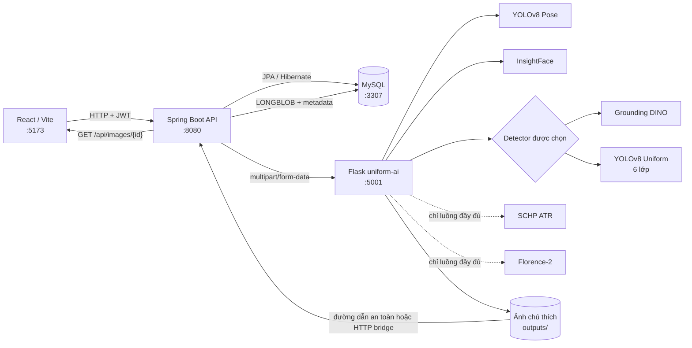

<h1 align="center">Hệ thống đánh giá tuân thủ đồng phục học sinh bằng AI</h1>

  Nền tảng web hỗ trợ nhận diện học sinh, đánh giá đồng phục theo lịch lớp và quản lý kết quả có thể kiểm chứng từ ảnh hoặc camera.

  
  
  
  
  
  

Ứng dụng kết hợp YOLOv8 Pose, InsightFace, Grounding DINO, mô hình YOLOv8 Uniform sáu lớp, SCHP và Florence-2 để tạo kết quả giải thích được. Quản trị viên có thể chọn luồng đầy đủ hoặc luồng nhẹ chạy đúng một detector; học sinh có thể xem lịch sử và gửi yêu cầu chỉnh sửa.

Repository gồm ba dịch vụ: frontend React/Vite, backend Spring Boot và dịch vụ AI Flask `uniform-ai`.

## Mục lục

- [Chức năng chính](#chức-năng-chính)
- [Kiến trúc](#kiến-trúc)
- [Các luồng đánh giá](#các-luồng-đánh-giá-hiện-tại)
- [Công nghệ](#công-nghệ)
- [Cấu trúc thư mục](#cấu-trúc-thư-mục)
- [Yêu cầu](#yêu-cầu)
- [Cài đặt cục bộ](#cài-đặt-cục-bộ)
- [API quan trọng](#api-quan-trọng)
- [Build và test](#build-và-test)
- [Lưu trữ và tương thích](#lưu-trữ-kết-quả-và-tính-tương-thích)
- [Khắc phục sự cố](#khắc-phục-sự-cố)
- [Bảo mật và quyền riêng tư](#bảo-mật-và-quyền-riêng-tư)

## Chức năng chính

- Đăng ký, đăng nhập và phân quyền <code>ADMIN</code>/<code>STUDENT</code>.
- Quản lý học sinh, tài khoản, dữ liệu khuôn mặt và lịch đồng phục theo lớp, theo thứ.
- Tải ảnh, chọn chế độ đánh giá và chọn detector cần chạy.
- Nhận diện người mục tiêu bằng YOLOv8 Pose và nhận diện/xác minh học sinh bằng InsightFace.
- Đánh giá đầy đủ bằng Grounding DINO hoặc YOLOv8 Uniform kết hợp SCHP và Florence-2.
- Đánh giá nhanh bằng đúng một detector được chọn, không chạy SCHP hoặc Florence-2.
- Kiểm tra detection theo vùng cơ thể, loại detection trùng lớp và chuẩn hóa sáu lớp đồng phục.
- Chấm điểm theo lịch lớp, hiển thị ảnh đã chú thích và cho phép chọn kết quả chính thức.
- Lưu lịch sử, trừ điểm rèn luyện, thống kê và xử lý yêu cầu chỉnh sửa.
- Phân tích camera thời gian thực bằng pipeline nhẹ Pose + InsightFace + YOLOv8 Uniform.
- Nhập ảnh kết quả AI vào MySQL và phục vụ ảnh qua API có xác thực.

## Kiến trúc

Backend là cổng API chính của frontend. Sau khi AI tạo ảnh chú thích, <code>AiProcessedImageImporter</code> kiểm tra đường dẫn/phần mở rộng và lưu ảnh vào bảng ảnh dạng <code>LONGBLOB</code>. Frontend đọc ảnh đã quản lý qua <code>GET /api/images/{id}</code>. Nếu backend và AI không dùng chung filesystem, backend có thể tải ảnh qua cầu HTTP của AI.

## Các luồng đánh giá hiện tại

### Ma trận lựa chọn trên giao diện

| Chế độ | Phương pháp | Module được chạy | Module bị bỏ qua |
| --- | --- | --- | --- |
| Đánh giá nhanh không dùng SCHP/FLORENCE | YOLOv8 V2 (6 lớp) | YOLOv8 Pose → InsightFace → YOLOv8 Uniform → kiểm tra/chấm điểm | Grounding DINO, SCHP, Florence-2 |
| Đánh giá nhanh không dùng SCHP/FLORENCE | Grounding DINO V2 | YOLOv8 Pose → InsightFace → Grounding DINO → kiểm tra/chấm điểm | YOLOv8 Uniform, SCHP, Florence-2 |
| Đánh giá V2 đầy đủ từng phương pháp | YOLOv8 V2 (6 lớp) | YOLOv8 Pose → InsightFace → YOLOv8 Uniform → SCHP → Florence-2 → kiểm tra/chấm điểm | Grounding DINO |
| Đánh giá V2 đầy đủ từng phương pháp | Grounding DINO V2 | YOLOv8 Pose → InsightFace → Grounding DINO → SCHP → Florence-2 → kiểm tra/chấm điểm | YOLOv8 Uniform |

Mỗi request lightweight mới tạo đúng một candidate và chỉ điền slot lịch sử tương ứng:

- <code>LIGHTWEIGHT_YOLOV8_UNIFORM</code> dùng slot YOLOv8.
- <code>LIGHTWEIGHT_GROUNDING_DINO</code> dùng slot Grounding DINO.

Các enum và bản ghi cũ vẫn được giữ nguyên. Luồng so sánh full hai phương pháp tại <code>/api/evaluations/compare</code> và các endpoint full V2 riêng vẫn khả dụng.

### Sáu lớp YOLOv8 Uniform

| ID | Khóa chuẩn |
| ---: | --- |
| 0 | <code>ao_so_mi_trang</code> |
| 1 | <code>ao_doan_thanh_nien</code> |
| 2 | <code>quan_tay_dai_den</code> |
| 3 | <code>khan_quang_do</code> |
| 4 | <code>quan_short_tay_den</code> |
| 5 | <code>quan_dai_trang</code> |

## Công nghệ

### Frontend web

- React 18, TypeScript strict mode.
- Vite 7.
- React Router 6.
- Axios.
- Tabler Icons.
- CSS thuần trong <code>frontend/src/styles.css</code>.

### Backend API

- Java 17.
- Spring Boot 3.3.5.
- Spring Web, Spring WebFlux/WebClient.
- Spring Security, JWT.
- Spring Data JPA/Hibernate.
- MySQL; H2 dùng cho test.
- Maven.

### Dịch vụ AI

- Python 3.10 và Flask.
- PyTorch, Transformers, Ultralytics, OpenCV.
- YOLOv8 Pose.
- InsightFace và ONNX Runtime.
- Grounding DINO.
- YOLOv8 Uniform sáu lớp.
- SCHP ATR.
- Florence-2.

## Cấu trúc thư mục

~~~text
uniform-lib/
├── backend/
│   ├── pom.xml
│   └── src/
│       ├── main/java/com/uniform/management/
│       ├── main/resources/application.properties
│       └── test/
├── frontend/
│   ├── package.json
│   ├── vite.config.ts
│   └── src/
│       ├── api/
│       ├── components/
│       ├── context/
│       ├── pages/
│       ├── utils/
│       ├── App.tsx
│       ├── styles.css
│       └── types.ts
├── uniform-ai/
│   ├── app.py
│   ├── requirements.txt
│   ├── .env.example
│   ├── app/
│   │   ├── face/
│   │   ├── pose_estimation/
│   │   ├── services/
│   │   ├── uniform_validation/
│   │   └── utils/
│   ├── yolov8_6class/
│   ├── face-recognition-service/
│   └── test_*.py
└── README.md
~~~

Các thư mục <code>node_modules</code>, <code>dist</code>, <code>target</code>, virtual environment, model weights, dữ liệu khuôn mặt, ảnh tải lên và ảnh đầu ra là dependency hoặc dữ liệu runtime; chúng không nên được commit.

## Yêu cầu

- Windows 11 hoặc môi trường tương đương có PowerShell.
- Git.
- JDK 17.
- Maven 3.8 trở lên.
- Node.js đáp ứng Vite 7: từ 20.19 hoặc từ 22.12 trở lên.
- Python 3.10.
- MySQL 8.
- Dung lượng trống cho model và cache.
- GPU CUDA là tùy chọn; AI có thể chạy CPU nhưng chậm hơn đáng kể.

Môi trường đã dùng để xác minh repository này: Java 17, Maven 3.8.8, Node.js 24, npm 11 và Python 3.10 trong <code>uniform-ai/.venv</code>.

## Cài đặt cục bộ

Các lệnh dưới đây giả sử terminal đang ở <code>&lt;PROJECT_ROOT&gt;</code>.

### 1. Chuẩn bị MySQL

Cấu hình mặc định dùng database <code>uniform_management</code> tại cổng <code>3307</code>. Kiểm tra dịch vụ MySQL trên Windows:

~~~powershell
Get-Service -Name "*MySQL*"
~~~

Nếu tên dịch vụ là <code>MySQL80</code>, mở PowerShell có quyền phù hợp và chạy:

~~~powershell
Start-Service -Name "MySQL80"
~~~

Tên dịch vụ và cổng có thể khác theo máy. Tạo database bằng MySQL Workbench hoặc MySQL client:

~~~sql
CREATE DATABASE IF NOT EXISTS uniform_management
  CHARACTER SET utf8mb4
  COLLATE utf8mb4_unicode_ci;
~~~

Hibernate đang dùng <code>spring.jpa.hibernate.ddl-auto=update</code>, vì vậy database phải tồn tại trước khi backend khởi động; các bảng sẽ được tạo/cập nhật tự động.

### 2. Chuẩn bị dịch vụ AI

~~~powershell
cd <PROJECT_ROOT>\uniform-ai
py -3.10 -m venv .venv
.\.venv\Scripts\Activate.ps1
python -m pip install --upgrade pip
python -m pip install -r requirements.txt
Copy-Item .env.example .env
~~~

Nếu PowerShell chặn script kích hoạt, có thể gọi trực tiếp:

~~~powershell
.\.venv\Scripts\python.exe -m pip install -r requirements.txt
.\.venv\Scripts\python.exe app.py
~~~

Các asset cần có cho đầy đủ chức năng:

- <code>uniform-ai/yolov8n-pose.pt</code>.
- <code>uniform-ai/yolov8_6class/best.pt</code>.
- Repository SCHP tại <code>uniform-ai/third_party/schp</code>.
- Checkpoint SCHP tại <code>uniform-ai/weights/exp-schp-201908301523-atr.pth</code>.
- Dữ liệu InsightFace đã enroll trong thư mục runtime <code>uniform-ai/storage</code>.

Grounding DINO, Florence-2 và InsightFace có thể cần tải model/cache ở lần chạy đầu. Cần kết nối mạng hoặc cache model có sẵn. Các file trọng số lớn không được Git theo dõi.

Khởi động AI:

~~~powershell
cd <PROJECT_ROOT>\uniform-ai
.\.venv\Scripts\python.exe app.py
~~~

Mặc định: <code>http://127.0.0.1:5001</code>.

### 3. Cấu hình và chạy backend

Không ghi credential thật vào <code>application.properties</code>. Thiết lập biến môi trường trong terminal chạy backend:

~~~powershell
cd <PROJECT_ROOT>\backend
$env:DB_URL="jdbc:mysql://localhost:3307/uniform_management?useSSL=false&allowPublicKeyRetrieval=true&serverTimezone=Asia/Ho_Chi_Minh&characterEncoding=UTF-8"
$env:SPRING_DATASOURCE_USERNAME="YOUR_DB_USERNAME"
$env:SPRING_DATASOURCE_PASSWORD="YOUR_DB_PASSWORD"
$env:SECURITY_JWT_SECRET="YOUR_SECRET_KEY_AT_LEAST_32_CHARACTERS"
$env:UNIFORM_ADMIN_EMAIL="YOUR_ADMIN_EMAIL"
$env:UNIFORM_ADMIN_PASSWORD="YOUR_ADMIN_PASSWORD"
$env:UNIFORM_AI_BASE_URL="http://127.0.0.1:5001"
$env:UNIFORM_AI_FACE_BASE_URL="http://127.0.0.1:5001"
$env:UNIFORM_AI_OUTPUT_ROOT=(Resolve-Path "..\uniform-ai\outputs").Path
mvn spring-boot:run
~~~

<code>UNIFORM_ADMIN_EMAIL</code> và <code>UNIFORM_ADMIN_PASSWORD</code> chỉ được dùng để tạo admin đầu tiên khi database chưa có admin. Hãy dùng giá trị riêng cho từng môi trường.

<code>UNIFORM_AI_OUTPUT_ROOT</code> phải trỏ tới thư mục output AI trên chính máy backend. Nếu hai dịch vụ không chia sẻ filesystem, để cấu hình này trống và bảo đảm backend truy cập được URL ảnh AI để dùng HTTP fallback.

Mặc định: <code>http://localhost:8080</code>.

### 4. Cấu hình và chạy frontend

~~~powershell
cd <PROJECT_ROOT>\frontend
npm ci
~~~

Tạo <code>frontend/.env.local</code> cho máy phát triển bằng các giá trị công khai phù hợp môi trường:

~~~dotenv
VITE_API_BASE_URL=http://localhost:8080
VITE_AI_MEDIA_BASE_URL=http://127.0.0.1:5001
~~~

Không đặt password, JWT secret hoặc token người dùng vào biến <code>VITE_*</code> vì các giá trị này được đóng gói vào mã frontend.

Khởi động:

~~~powershell
npm run dev
~~~

Mặc định: <code>http://127.0.0.1:5173</code>.

## Cổng mặc định

| Thành phần | Cổng | URL |
| --- | ---: | --- |
| Frontend Vite | 5173 | <code>http://127.0.0.1:5173</code> |
| Spring Boot | 8080 | <code>http://localhost:8080</code> |
| Flask uniform-ai | 5001 | <code>http://127.0.0.1:5001</code> |
| MySQL | 3307 | Theo <code>DB_URL</code> |

## API quan trọng

### API backend

| Method | Endpoint | Mục đích |
| --- | --- | --- |
| POST | <code>/api/auth/register</code> | Đăng ký |
| POST | <code>/api/auth/login</code> | Đăng nhập |
| POST | <code>/api/admin/evaluations/lightweight</code> | Chạy một lightweight detector đã chọn |
| POST | <code>/api/admin/evaluations/yolov8-v2</code> | Chạy full V2 YOLOv8 |
| POST | <code>/api/admin/evaluations/grounding-dino-v2</code> | Chạy full V2 Grounding DINO |
| POST | <code>/api/evaluations/compare</code> | Luồng so sánh full tương thích cũ |
| POST | <code>/api/evaluations/compare/start</code> | Bắt đầu comparison full bất đồng bộ |
| GET | <code>/api/evaluations/compare/status/{jobId}</code> | Đọc trạng thái comparison |
| POST | <code>/api/evaluations/{runId}/choose-official</code> | Lưu kết quả chính thức |
| GET | <code>/api/evaluation-history</code> | Lịch sử dành cho admin |
| GET | <code>/api/evaluation-history/me</code> | Lịch sử của học sinh hiện tại |
| POST | <code>/api/correction-requests</code> | Gửi yêu cầu chỉnh sửa |
| GET/PUT | <code>/api/admin/uniform-requirement-schedules/{classId}</code> | Đọc/cập nhật lịch đồng phục |
| POST | <code>/api/admin/realtime-camera/analyze-frame</code> | Phân tích một frame camera |
| GET | <code>/api/images/{id}</code> | Đọc ảnh đã lưu có xác thực |

Endpoint lightweight nhận <code>multipart/form-data</code>:

- <code>image</code>: bắt buộc.
- <code>studentCode</code>: tùy chọn; có giá trị thì dùng chế độ verify, không có thì identify.
- <code>selectedMethod</code>: bắt buộc, nhận <code>YOLOV8_V2</code> hoặc <code>GROUNDING_DINO_V2</code>.
- <code>uniformMethod</code>: alias tương thích với client cũ.

Ví dụ:

~~~powershell
curl.exe -X POST "http://localhost:8080/api/admin/evaluations/lightweight" -H "Authorization: Bearer YOUR_ADMIN_TOKEN" -F "image=@.\sample.jpg" -F "studentCode=STUDENT_CODE" -F "selectedMethod=YOLOV8_V2"
~~~

Ngoại trừ API xác thực công khai, backend yêu cầu JWT. Các endpoint đánh giá và camera dành cho admin.

### API uniform-ai

| Method | Endpoint | Mục đích |
| --- | --- | --- |
| GET | <code>/api/ai/health</code> | Trạng thái dịch vụ tích hợp |
| GET | <code>/api/uniform/health</code> | Trạng thái module đồng phục |
| POST | <code>/api/ai/evaluate-student-lightweight</code> | Pose + InsightFace + một detector lightweight |
| POST | <code>/api/uniform/evaluate/lightweight</code> | Một detector lightweight không chạy nhận diện khuôn mặt |
| POST | <code>/api/uniform/evaluate/yolov8-v2</code> | Full V2 YOLOv8 |
| POST | <code>/api/uniform/evaluate/grounding-dino-v2</code> | Full V2 Grounding DINO |
| POST | <code>/api/ai/evaluate-student</code> | Luồng đánh giá học sinh đầy đủ/tương thích |
| POST | <code>/api/uniform/evaluate</code> | Luồng comparison AI tương thích |
| POST | <code>/api/realtime-camera/analyze-frame</code> | Pipeline camera nhẹ |
| POST | <code>/api/face/enroll</code> | Enroll khuôn mặt |
| POST | <code>/api/face/verify</code> | Xác minh khuôn mặt |
| POST | <code>/api/face/identify</code> | Nhận diện khuôn mặt |

AI lightweight chấp nhận <code>uniform_method</code>, <code>selected_method</code> hoặc <code>method</code>. Backend gửi khóa chuẩn <code>LIGHTWEIGHT_YOLOV8_UNIFORM</code> hoặc <code>LIGHTWEIGHT_GROUNDING_DINO</code>. Thiếu method hoặc method không hỗ trợ trả HTTP 400.

## Build và test

### Build frontend

~~~powershell
cd <PROJECT_ROOT>\frontend
npm run build
~~~

<code>package.json</code> hiện không cấu hình script test hoặc lint riêng; <code>npm run build</code> chạy TypeScript build trước Vite build.

### Test và đóng gói backend

~~~powershell
cd <PROJECT_ROOT>\backend
mvn test
mvn package -DskipTests
~~~

Test backend dùng H2 profile, không cần MySQL hoặc AI server đang chạy.

### Kiểm tra AI

Luôn dùng Python trong virtual environment:

~~~powershell
cd <PROJECT_ROOT>\uniform-ai
.\.venv\Scripts\python.exe -m py_compile app.py test_lightweight_method_selection.py
.\.venv\Scripts\python.exe -m unittest -v test_lightweight_method_selection.py test_uniform_v2_contract.py
~~~

Các file <code>test_grounding.py</code>, <code>test_florence.py</code>, <code>test_florence2.py</code> và <code>test_pose_yolo_association.py</code> là script kiểm tra model/CLI thủ công; không chạy test discovery toàn thư mục nếu chưa chuẩn bị model, ảnh đầu vào và GPU phù hợp.

## Lưu trữ kết quả và tính tương thích

- <code>EvaluationRun</code> giữ hai slot lịch sử: Grounding DINO ở slot 1 và YOLOv8 ở slot 2.
- Full comparison có thể điền cả hai slot.
- Lightweight single-method chỉ điền slot đã chọn; slot còn lại không được hiển thị như một kết quả giả.
- <code>results</code>/<code>candidates</code> trong response chứa đúng các phương pháp thực sự đã chạy.
- Kết quả chính thức tạo bản ghi <code>EvaluationHistory</code>, ảnh gốc/ảnh xử lý và snapshot lịch đồng phục.
- Bản ghi cũ, enum cũ và các route frontend cũ tiếp tục được đọc.
- Không có migration database mới cho việc tách lightweight method.

## Khắc phục sự cố

### Backend không kết nối MySQL

- Kiểm tra dịch vụ MySQL đang chạy.
- Kiểm tra cổng thực tế. Nếu MySQL dùng cổng 3306, cập nhật <code>DB_URL</code> thay vì giữ mặc định 3307.
- Tạo database <code>uniform_management</code> trước khi chạy Spring Boot.
- Dùng đúng <code>SPRING_DATASOURCE_USERNAME</code> và <code>SPRING_DATASOURCE_PASSWORD</code>.

### AI báo thiếu model

- Kiểm tra các đường dẫn model trong phần cài đặt.
- Không đổi tên <code>yolov8_6class/best.pt</code>; service production không fallback sang <code>last.pt</code>.
- Kiểm tra metadata sáu lớp trong <code>yolov8_6class</code>.
- Kiểm tra cache/mạng khi Grounding DINO, Florence-2 hoặc InsightFace tải model lần đầu.

### AI chậm hoặc hết bộ nhớ

- Luồng full tải nhiều model và có timeout backend mặc định 300 giây.
- Dùng chế độ lightweight khi không cần kiểm tra SCHP/Florence-2.
- Đặt <code>UNIFORM_FORCE_CPU=1</code> khi cần buộc chạy CPU.
- Chỉ chạy một instance AI cho cùng GPU nếu VRAM hạn chế.

### Không hiển thị ảnh kết quả

- Đặt <code>UNIFORM_AI_OUTPUT_ROOT</code> đúng thư mục <code>uniform-ai/outputs</code> nếu hai service chia sẻ filesystem.
- Kiểm tra backend có thể truy cập AI tại <code>UNIFORM_AI_BASE_URL</code> nếu dùng HTTP fallback.
- Không phục vụ trực tiếp đường dẫn local cho trình duyệt; frontend ưu tiên <code>/api/images/{id}</code>.

### Lỗi CORS hoặc camera

- Phát triển local dùng frontend <code>127.0.0.1:5173</code> và backend <code>localhost:8080</code>.
- Camera trình duyệt hoạt động trên localhost; môi trường triển khai cần HTTPS.
- Danh sách origin hiện được cấu hình trong <code>SecurityConfig</code>; phải rà soát và thu hẹp danh sách cho domain triển khai thực tế.

## Bảo mật và quyền riêng tư

- Không commit <code>.env</code>, <code>.env.local</code>, password, JWT secret, API token hoặc tunnel token.
- Không đặt secret trong biến <code>VITE_*</code>.
- Không commit model weights, ảnh học sinh, dữ liệu sinh trắc học, embedding, uploads hoặc outputs.
- Dùng secret riêng cho từng môi trường và thay đổi credential khởi tạo ngay sau khi thiết lập.
- Chỉ cấp quyền đọc dữ liệu khuôn mặt, ảnh và lịch sử cho người có trách nhiệm.
- Dùng HTTPS và cấu hình CORS hẹp khi triển khai.
- Sao lưu MySQL và dữ liệu face enrollment theo chính sách bảo vệ dữ liệu của đơn vị vận hành.

README này chỉ dùng URL localhost, đường dẫn tương đối và placeholder; không chứa credential, token, thông tin định danh cá nhân hoặc đường dẫn máy cá nhân.
